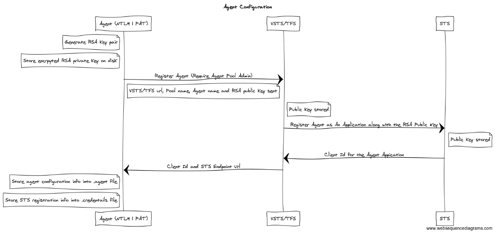
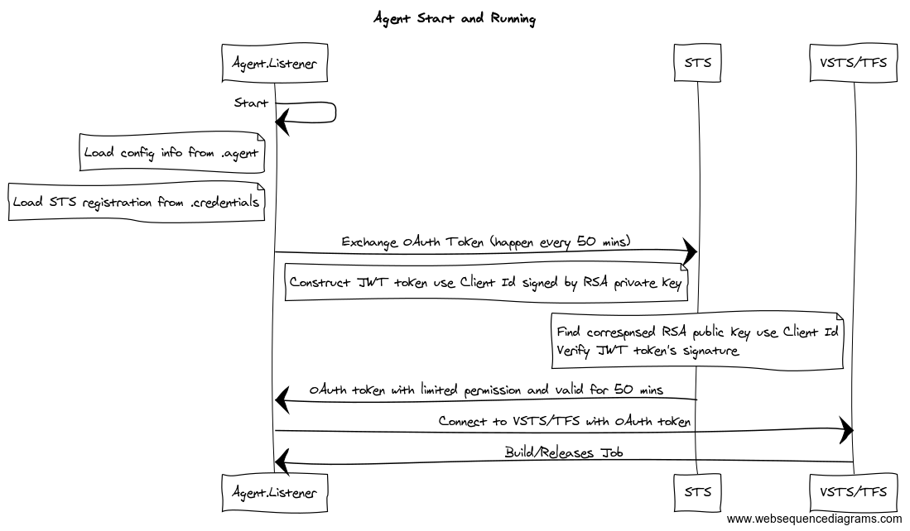
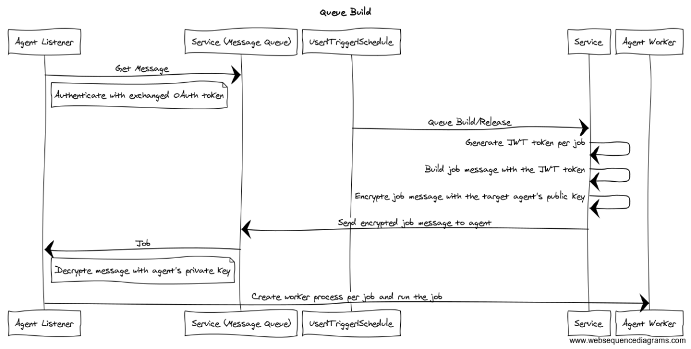

# Agent Authentication and Authorization

## Goals
  - Support agent installs in untrusted domains
  - The account that configures or runs the agent process is not relevant for accessing Azure DevOps resources.
  - Accessing Azure DevOps resources is done with a per-job token which expires when job completes.
  - The token is granted to trusted parts of the system including the agent, installed tasks and script steps specified by the build admin as trusted. 
  - Protect the token from developer contributions such as unit tests, msbuild targets (not designated as trusted by the build admin). 
  - Same code and scheme for agents connecting to either Azure DevOps in the cloud or deployed on-prem.

## Configuration

Configuring an agent registers an agent with a pool using your identity.  
Configuring an agent is [covered here in the documentation](https://www.visualstudio.com/en-us/docs/build/actions/agents/v2-windows).

Configuration is done with the user being authenticated via a PAT (or AAD).
On-premisis deployments also support integrated auth (domain logged on credentials) or NTLM (supply username and password from non domain joined machine - typically Linux or OSX).

*Your credentials are not stored and are only relevant for registering the agent with the service.*

During configuration an RSA public/private key pair is created, the private key is stored in file on disk, on windows the content is protected with DPAPI (machine level encrypted - agent only valid on that machine) and on Linux/OSX with chmod permissions.

Using your credentials, the agent is registered with the service by sending the public key to the service which adds that agent to the pool and stores the public key, STS will generate clientId associated with the public key.

## Start and Listen

After configuring the agent, the agent can be started interactively (./run.cmd or ./run.sh) or as a service.

On start, the agent listener process loads the RSA private key (on windows decrypting with machine key DPAPI), sends a JWT token which signed by the private key to the service.
The server response with an OAuth token that grants permission to access the message queue (http long poll), allowing the agent to acquire the messages it will eventually run.

## Queue Build

When a build is queued, its demands are evaluated, it is matched to an agent and a message is placed in a queue of messages for that agent.  
The agent is listening for jobs via the message queue http long poll.  
The message encrypted with the agent's public key, stored during agent configuration.  

A build is queued manually or as the result of a check-in trigger or build schedule.  
A [JWT token](http://self-issued.info/docs/draft-ietf-oauth-json-web-token.html) is generated, granting limited access to the project or collection level build service account (see options tab of build definition).  
The lifetime of the JWT token is the lifetime of the build or at most the build timeout (options tab).

## Accessing Azure DevOps Resources

The job message sent to the agent contains the token to talk back to Azure DevOps.  
The agent listener parent process will spawn an agent worker process for that job and send it the job message over IPC.
The token is never persisted.

Each task is run as a unique subprocess. 
The encrypted access token will be provided as an environment variable in each task subprocess.  
The token is registered with the agent as a secret and scrubbed from the logs as they are written.

There is an option to make the token accessible to ad-hoc scripts during the build (powershell, bash, and batch task scripts).

NOTE: The point is to make the token not *readily* available to developer contributed assets like unit tests and build (msbuild etc..) targets and scripts.  
The token is meant for tasks and scripts that are trusted by the build admin by (1) installing the task or (2) directing a build definition to run that script.  
The goal is to avoid having the token accidentally leak in scripts.  
Even then, the token will expire at the end of the job which helps mitigate any accidental exposure.

## Keeping RSA private key - security implications
Agent stores RSA private key in a '.credentials_rsaparams' file in the agent root directory.
For Windows host - it is protected by [DPAPI](https://docs.microsoft.com/dotnet/standard/security/how-to-use-data-protection).
On Linux/OSX - it sets up chmod permissions (read & write) to the user which configured the agent (by calling 'chmod 600' command) - so this user will be able to reconfigure the agent.

For user which runs the agent - there should be permissions to read '.credentials_rsaparams' file. 
No other permissions are required for this file - please make sure that you don't grant any additional permissions since this file stores sensitive connection data.

An RSA private key is being created during agent configuration and removed only after running of 'config remove' command.
If this file will be removed - you need to run 'config remove' command and configure it again to register the agent.

This is actual for all agent modes (running as interactive, 'run once' mode, running as a service).